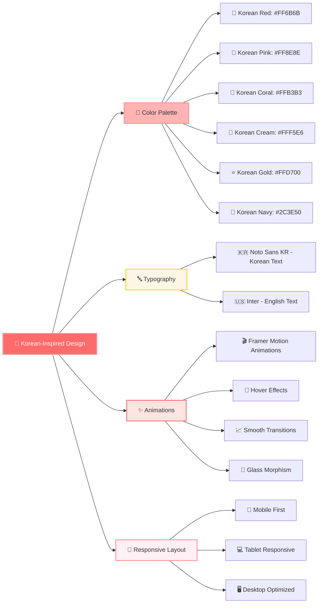
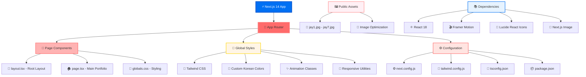
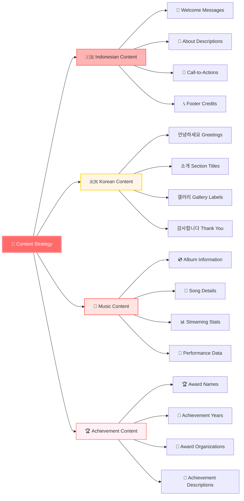
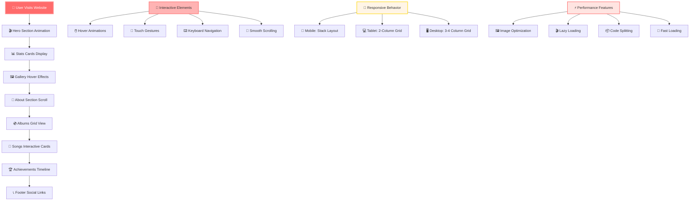

# Raina Jay ENHYP - Website Flowchart

## 🎯 Website Structure & Navigation Flow

```mermaid
flowchart TD
    A[🏠 Homepage - Raina Jay ENHYP] --> B[📱 Navigation Bar]
    B --> C[👤 Hero Section]
    B --> D[📊 Stats Section]
    B --> E[🖼️ Gallery Section]
    B --> F[ℹ️ About Section]
    B --> G[💿 Albums Section]
    B --> H[🎵 Songs Section]
    B --> I[🏆 Achievements Section]
    B --> J[📞 Footer]
    
    C --> C1[🎬 Auto-rotating Image Carousel]
    C --> C2[👋 Welcome Message - Bilingual]
    C --> C3[🎯 Call-to-Action Buttons]
    
    D --> D1[👥 Followers: 2.5M+]
    D --> D2[🎵 Streaming: 50M+]
    D --> D3[⭐ Performances: 100+]
    D --> D4[❤️ Likes: 1M+]
    
    E --> E1[📸 Photo 1 - jay1.jpg]
    E --> E2[📸 Photo 2 - jay2.jpg]
    E --> E3[📸 Photo 3 - jay3.jpg]
    E --> E4[📸 Photo 4 - jay4.jpg]
    E --> E5[📸 Photo 5 - jay5.jpg]
    E --> E6[📸 Photo 6 - jay6.jpg]
    E --> E7[📸 Photo 7 - jay7.jpg]
    
    F --> F1[📝 Personal Introduction]
    F --> F2[🎭 Musical Journey]
    F --> F3[🌟 Artistic Philosophy]
    F --> F4[🇰🇷 Korean Description]
    
    G --> G1[💿 DIMENSION : DILEMMA - 2021]
    G --> G2[💿 MANIFESTO : DAY 1 - 2022]
    G --> G3[💿 DARK BLOOD - 2023]
    G --> G4[💿 ORANGE BLOOD - 2023]
    
    H --> H1[🎵 Given-Taken - 150M+ views]
    H --> H2[🎵 Drunk-Dazed - 200M+ views]
    H --> H3[🎵 Tamed-Dashed - 180M+ views]
    H --> H4[🎵 Future Perfect - 220M+ views]
    H --> H5[🎵 Bite Me - 300M+ views]
    H --> H6[🎵 Sweet Venom - 250M+ views]
    
    I --> I1[🏆 Rookie of the Year - MAMA 2021]
    I --> I2[🏆 Best New Male Artist - GDA 2021]
    I --> I3[🏆 Worldwide Fans Choice - MAMA 2022]
    I --> I4[🏆 Best Performance Award - SMA 2023]
    
    J --> J1[📱 Social Media Links]
    J --> J2[👩‍💻 Credit: Raina Yulia Farani]
    J --> J3[🌏 Bilingual Thank You Message]
    
    style A fill:#FF6B6B,stroke:#FF8E8E,stroke-width:3px,color:#fff
    style C fill:#FFB3B3,stroke:#FF8E8E,stroke-width:2px
    style D fill:#FFF5E6,stroke:#FFD700,stroke-width:2px
    style E fill:#FFE4E1,stroke:#FF6B6B,stroke-width:2px
    style F fill:#FFF0F5,stroke:#FF8E8E,stroke-width:2px
    style G fill:#FFB3B3,stroke:#FF6B6B,stroke-width:2px
    style H fill:#FFE4E1,stroke:#FF8E8E,stroke-width:2px
    style I fill:#FFF5E6,stroke:#FFD700,stroke-width:2px
    style J fill:#2C3E50,stroke:#34495E,stroke-width:2px,color:#fff
```

## 🎨 Design System Flow

## 🚀 Technical Architecture Flow

## 🌍 Content Management Flow

## 📱 User Experience Flow

---

## 📋 Summary

**Raina Jay ENHYP** adalah website portofolio modern yang menampilkan:

- 🎨 **Design Korean-inspired** dengan warna gradient yang indah
- 🌍 **Konten bilingual** (Indonesia & Korea)
- 📱 **Responsive design** untuk semua perangkat
- ✨ **Animasi smooth** dengan Framer Motion
- 🖼️ **Galeri foto** dengan 7 gambar Jay
- 💿 **Section album** dengan 4 album ENHYPEN
- 🎵 **Lagu populer** dengan 6 hit songs
- 🏆 **Penghargaan** dengan 4 prestasi
- 👩‍💻 **Credit** untuk Raina Yulia Farani

Website ini dibuat dengan teknologi modern Next.js 14, TypeScript, dan Tailwind CSS untuk memberikan pengalaman pengguna yang optimal.

